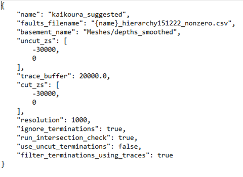

 # Leapfrog 3D mesh generation and fault cutting 

 ## Import inputs

1. Right click on GIS Data, Maps and Photos -- New Subfolder +
    create a subfolder with your project name, then subfolders
    of this named `traces`, `footprints`, `contours`.

2. Import the contours, footprints and traces into these
    folders by right clicking on the folder -- import vector
    data

3. Import the grid to use as the depth cut off for faulting by
     right clicking on Meshes -- import elevation grid

##  Run fault modelling

1.  `File -> Fault System Modelling -> Rebuild Fault System`. This
    will ask you to select a json file (easiest to keep this in
    the folder where the project is)
    **"name"** needs to be the name of your first subfolder,
    **"faults_filename"** is the file with the fault hierarchy in
    it, "basement_name" is the location (in the leapfrog
    project) of the base mesh, **"uncut_zs"** is the depth range to
    make the initial uncut faults in, "trace buffer" ... ,
    "cut_zs" is the depth range to cut the fault surfaces to (in
    practice this will be the depth to the depth mesh but could
    use this if wanted a uniform surface), "resolution" is the
    resolution of fault interactions/terminations in m (based on
    some issues I've been having, might want to set this a bit
    smaller e.g. 100m), **"ignore_terminations"**,
    **"run_intersection_check"** runs a check on whether the faults
    intersect once they've been cut which is slightly less
    important now that we're making buffers around the areas
    where faults intersect, **"use_uncut_terminations"** can be used
    to truncate faults against the uncut version of their meshes
    rather than the cut version (which you generally won't
    want), **"filter_terminations_using_traces"** stops faults on
    opposite sides of an earlier fault from generating
    termination lines on each other.

   

2. `File -> Fault System Modelling -> Create termination models`
    (seems to fail on some faults, but work if go to Projects --
    retry failed task after running)

3. File -- Fault System Modelling \-- add termination
     boundaries

4. File -- Fault System Modelling \-- Extract main fault parts.
    The final fault network will be in a folder called
    Meshes/{name}/extracted

5.  Save the extracted meshes by right clicking on this folder
    -- Export Meshes -- Select All, Format: \*.obj and choose
    the folder you want to save to

6. **In practice you'll want to check that this process gave
    you the faults you were actually expecting and that they've
    been cut/truncated properly so\...**

##  Quality Control

1.  Import traces into leapfrog scene (drag + drop the traces
    folder) - I've found it helpful to go through the extracted
    meshes and make sure they correspond to the surface traces +
    don't have intersections with other faults. The most common
    problems are that the trace of another fault doesn't quite
    truncate a fault so that the fault goes beyond its surface
    trace -- might be solved by changing "resolution" to be
    smaller (see above), that a fault intersection doesn't get
    picked up or that a fault doesn't fully cut through another
    so you end up with a long slot in the fault rather than a
    truncation.

2. To check for fault intersections in the final model:

    1.  rename Meshes/{name}/output to something else e.g.
        Meshes/{name}/output1

    2.  rename Meshes/{name}/extracted to Meshes/{name}/output

    3.  run File -- Fault System Modelling -- check Fault Mesh
        intersections

    4.  Change back the folder names (just so you don't forget
        later) - this is a bit of a hack but Check Fault Mesh
        Intersections works on the folder "output"
   

3. If there are intersections which need adding in as
     terminations, there are two possibilities:

     1.  The fault which needs truncating already has a
         termination listed in the terminations folder:

         1. Go to the geological model for this fault --
             boundary -- add lateral extent -- from distance
             function -- create new distance function -- choose
             the intersection line as the object for this
             distance function -- buffer -- set to 100m.

         2.  rerun "add termination boundaries" and "extract
             main fault parts" \-- might have to right click on
             the new termination in the GM -- switch inside

     2.  The fault which needs truncating doesn't have a
         termination:

         a.  Copy the intersection line to the "terminations"
             folder

         b.  Rename to the name of the fault being terminated

         c.  rerun "add termination boundaries" and "extract
             main fault parts" (I can't remember if you need to
             redo the GM section from the first case)

4. If a termination line needs editing (e.g. to bring it to the
    edge of a fault):

    1.  Right click on the termination line -- edit

    2.  Select snap to mesh vertex

    3.  Select 3D (in panel above scene)

    4.  Click on the last vertex in the line + hold down ctrl as
        you move it where you want it to be. Alternatively click
        "draw new line" in the line above and draw a new
        polyline as a termination boundary.

    5.  rerun "add termination boundaries" and "extract main
        fault parts"
