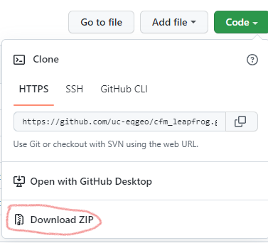

# Installation instructions

## Prerequisites

You'll need some form of conda, for example Anaconda3 or miniforge.

Installation instructions for Anaconda can be found [here](https://www.anaconda.com/products/individual#Downloads).

Alternatively (and better in most ways), install [miniforge](https://conda-forge.org/miniforge/).

You will also need to download the code from the GitHub repository (https://github.com/uc-eqgeo/cfm_leapfrog). 
If you are new to git, 
this is probably best to do using the download zip interface on GitHub. Make sure you unzip it if you do that.

## Installation

   1. Open Anaconda or Miniforge Prompt
   2. Run `cd {PATH_TO_REPO}` and hit `Enter`, where `{PATH_TO_REPO}` is the location where you have downloaded the code to, for example `C:\Users\{USER}\Documents\projects\cfm_leapfrog`. In this case, `{USER}` is your username.
Note that if you have downloaded to a drive that is different from your `C:` drive, you will need to change drives first; for example, type `D:` followed by `Enter`.
   3. Run `conda env create` and hit `Enter`.
   4. Run `conda activate leapfrog-fault-models` and hit `Enter`

