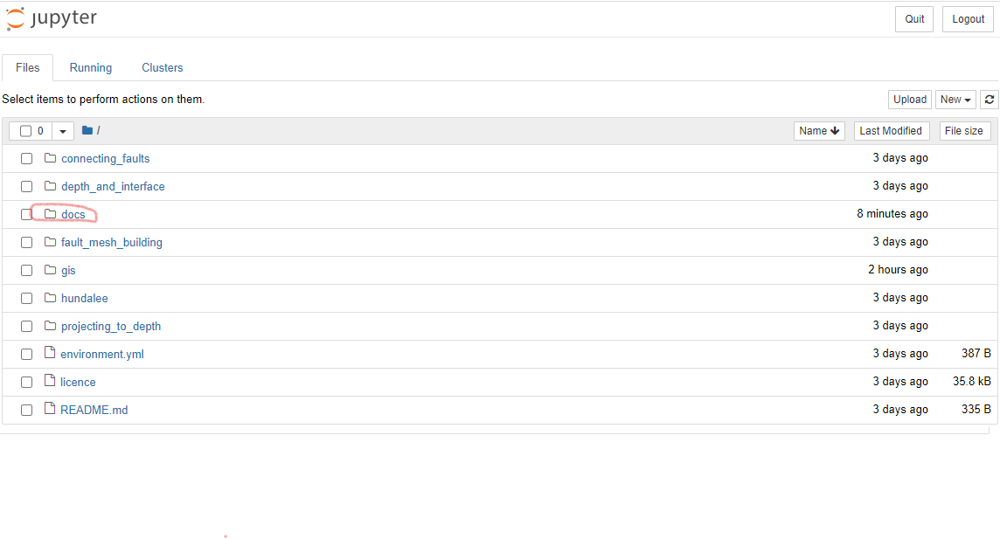

# Running tutorial examples using Jupyter

## Open Jupyter notebooks
1. Open Anaconda or Miniforge Prompt
2. Run `cd {PATH_TO_REPO}` and hit `Enter`, where `{PATH_TO_REPO}` is the location where you have downloaded the code to, for example `C:\Users\{USER}\Documents\projects\cfm_leapfrog`. In this case, `{USER}` is your username.
Note that if you have downloaded to a drive that is different from your `C:` drive, you will need to change drives first; for example, type `D:` followed `Enter`.
3. Type `jupyter notebook` and hit `Enter`.

These actions should open a new tab in your web browser that looks something like this.

4. Click through `docs` followed by `tutorials` to enter the directory where the example notebooks are stored.
5. Click on a tutorial to open it in a new tab:

